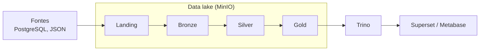

# Gabs Data Framework

Framework de dados open source para construir e operar pipelines em uma arquitetura *lakehouse*, montado do zero para estudo e evolução contínua.

O repositório reúne duas coisas:

- **A plataforma**: a infraestrutura e os serviços (armazenamento, processamento, catálogo, orquestração), definidos como código.
- **A biblioteca `gabs`**: funções Python compartilhadas por todos os pipelines, para que cada um se preocupe só com a própria regra de negócio.

Os pipelines de cada produto ficam em repositórios próprios, clonados dentro da pasta `dags/`.

## Objetivo

Criar uma arquitetura moderna de pipelines de dados, entendendo o papel de cada peça e como elas se conectam:

- armazenamento separado do processamento;
- dados organizados em camadas (arquitetura medalhão);
- tabelas com transações, histórico e *time travel*;
- infraestrutura reproduzível, versionada no Git;
- código de pipeline que não depende de onde roda (máquina local, VM ou cluster).

## Arquitetura



O Spark, com Delta Lake, faz as transformações entre as camadas. O Airflow orquestra a execução, o Hive Metastore registra as tabelas e o OpenMetadata documenta o que existe e de onde veio.

### Camadas

Cada camada é um bucket, organizado como `s3a://<camada>/<produto>/<tabela>`.

| Camada | Conteúdo |
|---|---|
| `landing` | Arquivo como veio da fonte (JSON, CSV), sem alteração |
| `bronze` | O mesmo dado em tabela Delta, sem regra de negócio |
| `silver` | Limpo, tipado, padronizado e sem duplicatas |
| `gold` | Agregado e modelado para consumo |

## Tecnologias

| Ferramenta | Papel | Situação |
|---|---|---|
| Docker e Docker Compose | Execução de todos os serviços em contêineres | Em uso |
| MinIO (fork Silo) | Data lake, com API compatível com S3 | Em uso |
| Apache Spark 3.5 (PySpark) | Processamento e transformação | Em uso |
| Delta Lake 3.3 | Formato de tabela: ACID, histórico e *time travel* | Em uso |
| JupyterLab | Exploração e prototipação | Em uso |
| Terraform | Infraestrutura como código | Código pronto |
| Google Cloud (Compute Engine) | Máquina virtual que hospeda a plataforma | Código pronto |
| PostgreSQL | Fonte de dados e banco do catálogo | Planejada |
| Hive Metastore | Catálogo de tabelas compartilhado | Planejada |
| Trino | Motor de consulta SQL sobre o lake | Planejada |
| Apache Airflow | Orquestração dos pipelines | Planejada |
| Apache Superset ou Metabase | Visualização | Planejada |
| OpenMetadata | Catálogo, linhagem e qualidade de dados | Planejada |

O MinIO comunitário foi descontinuado e teve as imagens oficiais retiradas do Docker Hub. Por isso o projeto usa o [Silo](https://github.com/pgsty/silo), um fork mantido que preserva a mesma API e as mesmas variáveis.

## Fases

| Fase | Entrega | Situação |
|---|---|---|
| 0 | Infraestrutura no GCP com Terraform: rede, firewall, VM, disco de dados e desligamento automático | Código pronto, VM ainda não criada |
| 1 | Núcleo do lakehouse: MinIO, Spark, Delta Lake e Jupyter | Concluída |
| 2 | Catálogo: PostgreSQL e Hive Metastore | Planejada |
| 3 | Camada SQL: Trino consultando as tabelas Delta | Planejada |
| 4 | Orquestração: Airflow rodando o pipeline da Landing à Gold | Planejada |
| 5 | Visualização: Superset ou Metabase conectado ao Trino | Planejada |
| 6 | Governança: OpenMetadata com linhagem e qualidade | Planejada |
| 7 | Extras: proxy com HTTPS, documentação com MkDocs, storage nativo da nuvem, cluster Spark | Planejada |

Cada fase entrega algo funcionando antes de a próxima começar.

## Estrutura do repositório

```
gabs_dataframework/
├── dags/                  # um repositório por produto, clonado aqui
├── docker/
│   ├── docker-compose.yml # serviços da plataforma
│   └── jupyter/Dockerfile # imagem com PySpark, Delta e conector S3
├── gabs/                  # biblioteca compartilhada
│   ├── spark.py           # sessão Spark configurada para Delta e MinIO
│   └── storage.py         # caminhos das camadas
├── infra/terraform/       # infraestrutura no GCP
├── notebooks/             # notebooks de exploração e validação
└── .env.example           # modelo das variáveis de ambiente
```

## Como executar

O estado atual sobe o MinIO e o JupyterLab com Spark e Delta Lake.

### Pré-requisitos

- Docker com o plugin Compose.
- Cerca de 4 GB de memória livre.

Também funciona no GitHub Codespaces, sem instalar nada na máquina.

### 1. Clonar e configurar

```bash
git clone https://github.com/sanchesfranklin/gabs_dataframework.git
cd gabs_dataframework
cp .env.example .env
```

Edite o `.env`:

| Variável | O que colocar |
|---|---|
| `MINIO_ROOT_USER` | Usuário administrador do MinIO |
| `MINIO_ROOT_PASSWORD` | Senha com 8 caracteres ou mais, sem `@`, `:`, `/`, `$` ou `#` |
| `JUPYTER_TOKEN` | Senha de acesso ao JupyterLab |
| `SPARK_DRIVER_MEMORY` | Memória do Spark, por exemplo `4g` |
| `HOST_UID` e `HOST_GID` | Saída de `id -u` e `id -g` |

O `.env` não vai para o Git.

### 2. Subir os serviços

Na raiz do repositório:

```bash
docker compose -f docker/docker-compose.yml --env-file .env up -d --build
```

O primeiro build leva alguns minutos. Para conferir:

```bash
docker compose -f docker/docker-compose.yml --env-file .env ps -a
```

| Contêiner | Estado esperado |
|---|---|
| `gabs-minio` | `Up (healthy)` |
| `gabs-minio-init` | `Exited (0)`, pois só cria os buckets e termina |
| `gabs-jupyter` | `Up` |

### 3. Acessar

| Serviço | Endereço | Credenciais |
|---|---|---|
| Console do MinIO | http://localhost:9001 | `MINIO_ROOT_USER` e `MINIO_ROOT_PASSWORD` |
| JupyterLab | http://localhost:8888 | `JUPYTER_TOKEN` |
| Spark UI | http://localhost:4040 | Disponível só com uma sessão Spark aberta |

As portas ficam presas em `127.0.0.1`. No Codespaces, abra pela aba **Ports**. Em uma VM, use um túnel SSH.

### 4. Validar

No JupyterLab, execute o notebook `01_primeira_tabela_delta.ipynb`, uma célula por vez. Ele grava uma tabela Delta na camada bronze, altera os dados, mostra o histórico e lê uma versão anterior.

Ao final, o bucket `bronze` deve conter `exemplo/cidades`, com arquivos Parquet e a pasta `_delta_log`.

### 5. Parar

```bash
docker compose -f docker/docker-compose.yml --env-file .env down
```

Os dados do MinIO ficam em um volume e são preservados. Para apagá-los também, acrescente `-v`.

### Problemas comuns

- **`gabs-minio-init` com `Exited (1)` e erro de *timeout***: a rede entre os contêineres não respondeu. Rode o `down` e depois o `up` novamente.
- **Erro de variável obrigatória ao subir**: falta preencher algum campo do `.env`.

## Usando a biblioteca

```python
from gabs import storage
from gabs.spark import get_spark_session

spark = get_spark_session("meu_pipeline")

caminho = storage.path("bronze", "vendas", "pedidos")   # s3a://bronze/vendas/pedidos
df = spark.read.format("delta").load(caminho)
```

O endereço e as credenciais do storage vêm de variáveis de ambiente, definidas no `docker-compose.yml`.

## Infraestrutura no GCP

A pasta `infra/terraform` cria a rede, o firewall restrito, a VM com Docker e um disco de dados separado, com desligamento automático diário. Copie `terraform.tfvars.example` para `terraform.tfvars`, preencha o ID do projeto e o seu IP, e rode `terraform init`, `plan` e `apply`.

---

© 2026 Sanches Franklin. Todos os direitos reservados.
Projeto de estudo. O código está disponível para consulta, sem licença de uso.